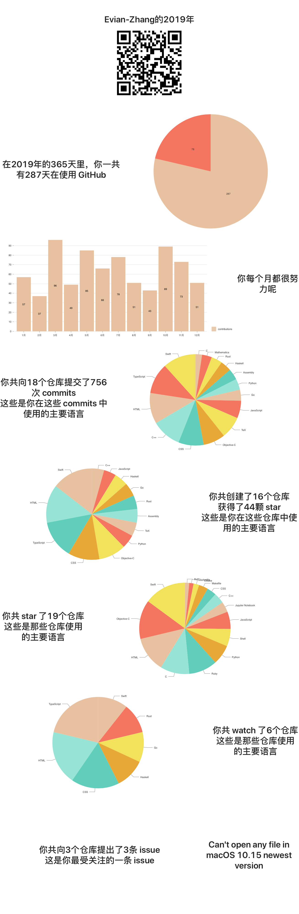

# My GitHub Year

## 简介

2019年末了，我在期末考试前，最后几个闲下来的日子里，做了一个可以总结 GitHub 用户2019年足迹的简单应用。现在可以去[evian-zhang.github.io/projects/my-github-year/index.html](https://evian-zhang.github.io/projects/my-github-year/index.html)访问。

这个应用很简单，纯前端页面，React框架，用的Ant Design的UI和nivo的图表库，以及GitHub v4 API.

功能也十分简单，只是总结2019年的足迹。只需要简单地改变`src/dataProcessor`中`query`的`from`和`to`就可以做到查看任意时间段的足迹了。现在只是总结了:

* contributions
* repositories
* commits
* stars
* watches
* issues
* pull requests

其实 GitHub v4 API 还有很多接口，大家可以提PR.

最后，祝大家2019完美收官，2020平安喜乐！

## 示例

用我的 GitHub 账号做个示例：
